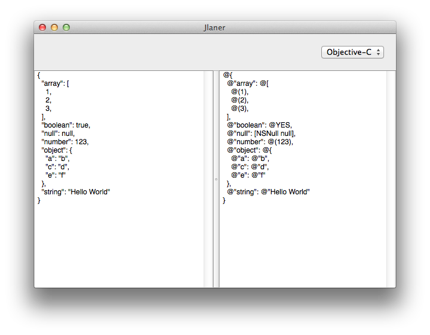
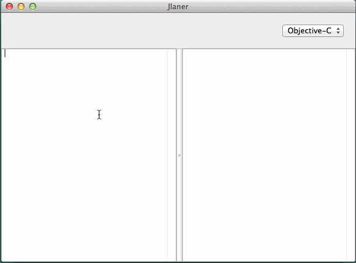

Jlaner - Convert JSON to literals
======

Jlaner is a Mac app (written in Swift) that allows you to convert **json** to a *literal* accepted by other languages.

> [Wikipedia](http://en.wikipedia.org/wiki/Literal_(computer_programming)): In computer science, a literal is a notation for representing a fixed value in source code. Almost all programming languages have notations for atomic values such as integers, floating-point numbers, and strings, and usually for booleans and characters; some also have notations for elements of enumerated types and compound values such as arrays, records, and objects.

Supported languages:

- Objective-C
- Swift

## Usage

Just paste the JSON on the left and it will be automatically converted to the selected language.

## Installation

Just run the project in Xcode ;) (*tested in Xcode 6 beta5*)

## Testing

I've been manually testing the conversion. I use this [default json](http://www.jsoneditoronline.org):

	{
	  "array": [
	    1,
	    2,
	    3
	  ],
	  "boolean": true,
	  "null": null,
	  "number": 123,
	  "object": {
	    "a": "b",
	    "c": "d",
	    "e": "f"
	  },
	  "string": "Hello World"
	}

And then I paste the results in the `swift_json.playground` for Siwft and in the `objc_json.m` for Objective-C.

## Author

Alejandro Martinez, alexito4@gmail.com
